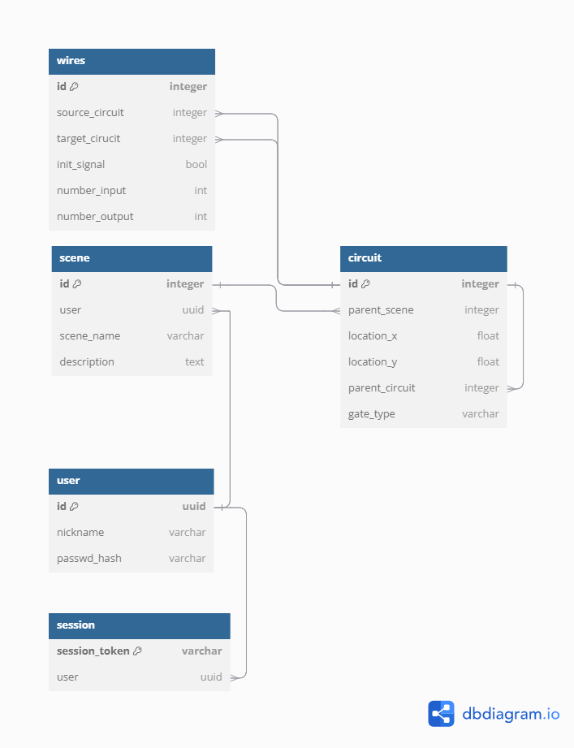

# Malphas Backend

The backend for the _Malphas_ logic simulator

## Building on POSIX-Compliant Systems

The following section will walk you through building _Malphas_ on UNIX-based systems.
The specific steps below demonstrate the process on a Debian-based distro, allthough
the general process is the same for all UNIX-based operating systems, such as _macOS_, as well as
other Linux distributions.

### Update Package Repositories

```shell
apt update
```

### Setting up build environment

This will install the required toolchain, including compilers and build systems

```shell
apt install build-essential cmake make gcc g++ libstdc++-14-dev 
```

### Installing Build Dependencies

The following command will install these build dependencies:

- ASIO Development headers
- OpenSSL
- Boost
- libpq

```shell
apt install libboost-all-dev openssl libpq-dev libasio-dev -y
```

### Acquiring the Source Code

```shell
git clone git@github.com:Medaware-org/Malphas-backend.git
cd Malphas-backend/
```

### Building

You can replace the `-j 4` in the command that follow with the desired number of parallel processes that `make` should
run.

#### Building *Without* the Codegen

This tells the CMake script **not** to build and execute the code generator. This option should be
used for the initial build, as the codegen won't work until all database migrations are completed.

```shell
cmake . -DNOCODEGEN=1
make -j 4
```

#### Enable Building the Code Generator

This will build the target `gen_dao` and execute the resulting binary, letting it overwrite the old DAO header.
The following is the exact command called in the CMake script:

```shell
./gen_dao > include/dao/dao.h
```

To build both `malphas` and `codegen`, run ...

```shell
cmake .
make -j 4
```

### Setting Up the Deployment

The only runtime dependency of this backend is the PostgreSQL database.
To deploy it, issue:

```shell
cd docker/
docker compose up -d
```

### Configuration

#### Database Details

The backend is pre-configured to deal with the credentials provided in the
compose file. Should you, however, choose to alter these, you will also need to change
the database configuration.
To do this, edit `config/db.cfg`, and insert the credentials that\ match your database.

```ini
[database]
user = <Database user>
db = <Database name>
password = <Database password>
host = <Database host>
port = <Database port>
```

#### Malphas Port

In order to change the port that the _Malphas_ backend is running on, you need to edit `config/malphas.cfg`
and change the `server.port` parameter according to your needs.

```ini
[server]
port = 1234
```

### Deployment
Deploying the backend is as simple as
```shell
./malphas
```


### Database Model

The following is an overview of the database model of _Malphas_:

